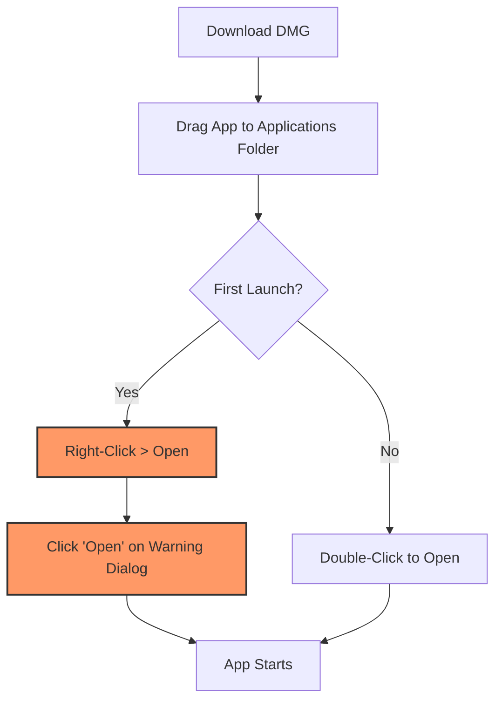

# PitchFixer 440

A macOS/iOS application that detects the pitch of audio files and corrects them to 440Hz (A4).

## Features

- **Pitch Detection**: Automatically detects the pitch of audio files
- **440Hz Correction**: Corrects detected pitch to 440Hz (A4)
- **Multiple Format Support**: Supports major audio formats including MP3, WAV, M4A
- **Drag & Drop**: Easy processing by simply dropping files

## 🚀 Installation (Important!)

Since this app is not notarized by Apple, you must follow these specific steps to bypass macOS security restrictions on the first launch.

### 📥 1. Download
1. Navigate to the [Releases](https://github.com/Tatsurou-Yajima/PitchFixer/releases) page.
2. Download the `PitchFixer.dmg` file from the latest version under the **Assets** section.

### 📋 2. Setup Steps
1. Open the downloaded **PitchFixer.dmg**.
2. Drag and drop **PitchFixer.app** into your **Applications** folder.
3. Locate the app in your Applications folder. **Right-click (or Control-click)** the app icon and select **"Open"**.
4. A warning dialog will appear. Click **"Open"** again to confirm.
   * *Note: This manual "Right-click > Open" is only required once. Subsequently, you can launch the app by double-clicking.*

### 🔄 Installation Flow




## Supported Platforms

- macOS 15.6 or later
- iOS 26.2 or later

## Requirements

- Xcode 26.2 or later
- Swift 5.0 or later

## Setup

### 1. Clone the Repository

```bash
git clone https://github.com/Tatsurou-Yajima/PitchFixer.git
cd PitchFixer
```

### 2. Open the Project in Xcode

```bash
open PitchFixer.xcodeproj
```

### 3. Resolve Dependencies

When you open the project, Swift Package Manager will automatically resolve dependencies:

- AudioKit 5.6.5 or later
- AudioKitEX 5.6.2 or later
- SoundpipeAudioKit 5.7.3 or later

### 4. Build and Run

- **macOS**: Press `Cmd + R` to build and run
- **iOS**: Select a simulator or device and press `Cmd + R` to build and run

## Usage

### macOS

1. Launch the app
2. Drag and drop an audio file into the drop area, or click the "Select File" button
3. The app will automatically detect the pitch
4. Click the "Correct to 440Hz and Save" button
5. Select a save location and save

### iOS

1. Launch the app
2. Tap the "Select File" button to choose an audio file
3. The app will automatically detect the pitch
4. Tap the "Correct to 440Hz and Save" button
5. Select a save location and save

## Tech Stack

- **SwiftUI**: User interface
- **AudioKit**: Audio processing and pitch detection
- **AVFoundation**: Reading and writing audio files
- **UniformTypeIdentifiers**: File type identification

## Project Structure

```
PitchFixer/
├── PitchFixer/
│   ├── PitchFixerApp.swift      # App entry point
│   ├── ContentView.swift         # Main UI and audio processing logic
│   └── Info.plist               # App settings
├── PitchFixer.xcodeproj/        # Xcode project file
└── README.md                    # This file
```

## Main Components

### AudioPitchManager
Manager class that performs pitch detection and correction of audio files.

- `detectPitch(url:completion:)`: Detects the pitch of an audio file
- `export(inputURL:outputURL:cents:completion:)`: Exports with pitch correction

### PitchAnalysisResult
Structure that holds pitch analysis results.

- `detectedHz`: Detected frequency (Hz)
- `centsOffset`: Cent deviation from 440Hz
- `reliability`: Detection reliability (number of detections)

## License

This is a personal development project.
